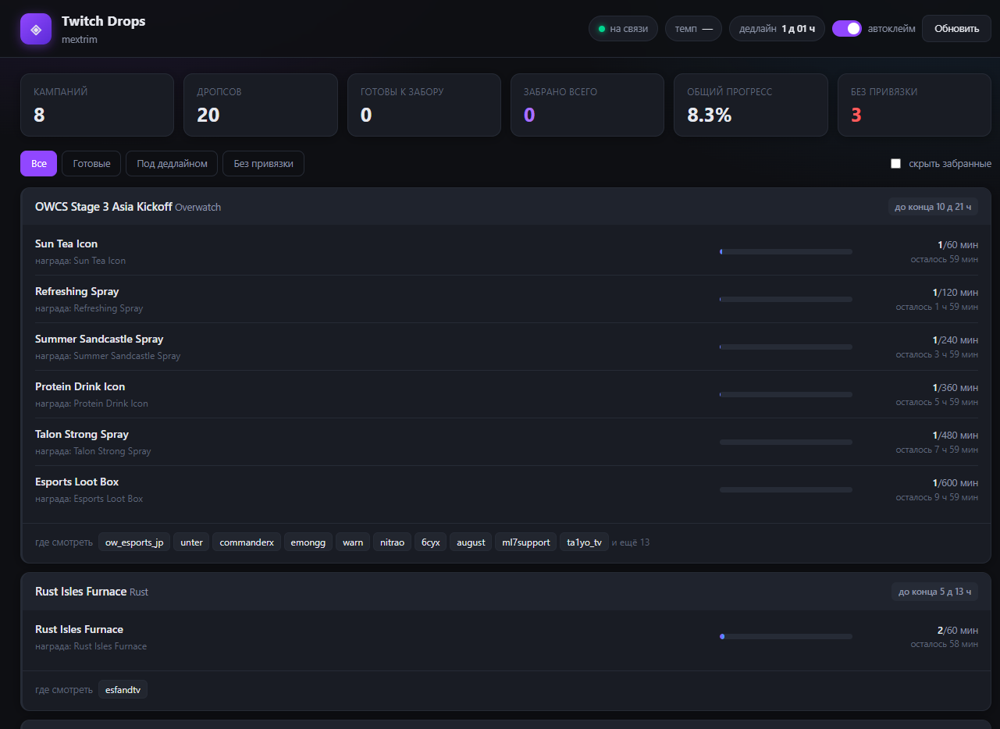

<div align="center">

# Twitch Drops

**Трекер прогресса дропсов с уведомлениями о готовых наградах.**
Панель в браузере и консольный режим, сборка в один `.exe`.

[](https://www.python.org/)
[](LICENSE)
[](https://www.microsoft.com/windows)
[](../../releases)
[](../../releases/latest)

</div>



---

## Что это

Программа следит за прогрессом ваших дропсов на Twitch и говорит, когда награда
дозрела. Показывает, сколько времени осталось, сколько смотрите вы, где
смотреть и когда кампания закончится.

<div align="center">

| ✅ Умеет | ❌ Не умеет |
|:---|:---|
| Следить за прогрессом всех дропсов | Накручивать время просмотра |
| Показывать, **где смотреть** каждый дропс | Забирать награды без вас |
| Считать темп просмотра и ETA | Видеть кампании, которые вы не начали |
| Предупреждать о дедлайнах | Работать без вашего токена |
| Звать в браузер, когда награда готова | — |

</div>

> **Про автоматизацию.** Программа читает ваш прогресс и подсказывает, когда
> пора нажать кнопку. Время просмотра она не накручивает — смотреть нужно
> самому. Автоматизация всё равно нарушает Terms of Service Twitch, аккаунт
> теоретически могут заблокировать. Не ставьте на это ценный основной аккаунт.

---

## Быстрый старт

**Нужен готовый `.exe` — Python не требуется.**

1. Скачайте [`TwitchDrops.exe`](../../releases/latest) из раздела Releases
   и положите в отдельную папку, например `C:\TwitchDrops\`
2. Скопируйте `auth-token` из cookie браузера:
   откройте `twitch.tv` под своим аккаунтом → `F12` → **Application** →
   **Cookies** → `https://www.twitch.tv` → поле **`auth-token`**
3. Скопируйте `config.example.json` в `config.json` и впишите токен
4. Запустите `TwitchDrops.exe` — панель откроется в браузере

Подробная инструкция со скриншотами — **[INSTALL.md](INSTALL.md)**.

Из исходников:

```bash
pip install -r requirements.txt
python twitch_drops.py --gui     # панель
python twitch_drops.py           # консоль
```

---

## Два интерфейса

### Панель

Веб-интерфейс на стандартной библиотеке — без Electron и прочих тяжестей,
поэтому `.exe` весит 10 МБ. Тёмная тема, обновление раз в 3 секунды,
каналы кликабельны.

Цветная полоса слева у карточки показывает состояние:

| Цвет | Значит |
|:---|:---|
| 🟢 зелёный | дропс дозрел, ждёт забора |
| 🟡 жёлтый | не успеваете до конца кампании |
| 🔴 красный | аккаунт игры не привязан, награда не придёт |
| ⚪ серый | кампания закончилась |

### Консоль

```
Twitch Drops  ·  mextrim  ·  автоклейм ВКЛ  ·  17:53:06
------------------------------------------------------------------------------
▸ Rust Isles Facemask  (Rust)  до конца 5 д 13 ч
    [###############-----]  75.0%  Rust Isles Facemask  осталось 15 мин
    где смотреть: cyr, mrwobblestwitch
------------------------------------------------------------------------------
▸ Rust Isles AR  (Rust)  до конца 5 д 13 ч
    [#-------------------]   5.0%  Rust Isles AR  осталось 57 мин
    где смотреть: hjune, hutnik
------------------------------------------------------------------------------
```

Кампании отсортированы по убыванию приоритета: сначала то, что почти готово и
под угрозой дедлайна.

---

## Почему забор вручную

Программа **не может забрать награду за вас**, и это ограничение Twitch.

Операцию забора (`DropsPage_ClaimDropRewards`) Twitch закрыл проверкой
браузерного отпечатка `Client-Integrity`: сервер требует отпечаток, который
выдаёт JS-клиентка Kasada при загрузке страницы настоящим браузером.

Проверено запросами к живому API:

| client_id | Чтение инвентаря | Забор наград |
|---|:---:|:---:|
| Мобильное приложение Android | ✅ | `IntegrityCheckFailed` |
| Веб-клиент | ✅ | `IntegrityCheckFailed` |
| Android TV | ✅ | `IntegrityCheckFailed` |
| Собственный OAuth-клиент | ✅ | `IntegrityCheckFailed` |

Проверялись все четыре с `android-` и `browser-User-Agent` — результат
одинаковый. **Смена `client_id` и OAuth-вход обхода не дают:** защищена сама
операция, а не приложение.

Что программа делает вместо этого: пищит, когда награда дозрела, и показывает
зелёную кнопку **«забрать →»**, которая открывает
[страницу инвентаря](https://www.twitch.tv/drops/inventory). Один клик — и
награда ваша, ведь нужное количество часов вы и так досмотрели.

---

## Что показывает

| | |
|---|---|
| Прогресс | По каждому предмету: сколько набрано из сколького нужно |
| Где смотреть | Список каналов, на которых капает именно этот дропс |
| Темп просмотра | Сколько минут прогресса в минуту, по двум замерам |
| ETA | Через сколько дозреет, с поправкой на темп |
| Дедлайны | Обратный отсчёт до конца кампании, с подсветкой риска |
| Предпосылки | Какой предмет нужно взять раньше |
| Привязка | Прямая ссылка, если аккаунт игры не привязан |
| История | Все когда-либо полученные награды (`--history`) |

### Про «все дропсы»

Программа показывает **все дропсы, которые Twitch отдаёт для вашего аккаунта**.
Полный каталог кампаний, которые вы ещё не начинали, она показать не может:
его отдаёт только операция `ViewerDropsDashboard`, а она требует той же
проверки целостности. REST-эндпоинта со списком кампаний не существует.

Обойти это можно вручную: та операция работает в обычном браузере, где
отпечаток настоящий. Выгрузите ответ через DevTools в файл и запустите
`--import-catalog catalog.json` — программа его разберёт и покажет каталог.

---

## Настройки

Всё в `config.json`. Менять почти ничего не нужно.

| Ключ | По умолчанию | Зачем |
|---|---|---|
| `auth_token` | — | **Обязательный.** Токен из cookie |
| `poll_interval` | `60` | Как часто опрашивать Twitch, секунды |
| `auto_claim` | `true` | Автозабор недоступен, ключ оставлен для совместимости |
| `show_channels` | `true` | Показывать списки каналов |
| `max_channels` | `8` | Сколько каналов показывать до «… и ещё N» |
| `warn_minutes_before_end` | `30` | За сколько минут предупреждать о дедлайне |
| `sound` | `true` | Звук, когда награда дозрела |
| `log_claims` | `true` | Писать журнал в `claims.csv` |
| `max_failures` | `10` | Столько ошибок подряд — остановиться |

Полный список и все ключи командной строки — в
[README ниже](#все-ключи-командной-строки) и в `config.example.json`.

### OAuth вместо cookie

Cookie-токен живёт несколько недель, а потом молча протухает. Через OAuth
программа получает живучий токен и обновляет его сама по `refresh_token`.

Подробности — в [INSTALL.md](INSTALL.md#способ-1б-oauth-вместо-cookie-необязательно).

---

## Безопасность

**Токен — это пароль от вашего аккаунта.** Кто им владеет, тот и заходит.

- `config.json` в `.gitignore` и **никогда** не попадает в репозиторий
- `claims.csv` с вашей историей тоже не коммитится
- В репозитории лежит только `config.example.json` — шаблон без токена
- Сменить токен: выйдите из аккаунта на twitch.tv и войдите заново

---

## Сборка из исходников

```bash
git clone https://github.com/Mextrim/twitch-drops.git
cd twitch-drops
pip install -r requirements.txt pyinstaller
python build_exe.py
```

Готовый файл: `dist\TwitchDrops.exe`. Интерфейс вшивается внутрь — отдельно
таскать `ui/` не нужно.

Релизы собираются автоматически: пушите тег `v*` — GitHub Actions соберёт
`.exe` и приложит его к релизу.

```
.github/workflows/build-exe.yml
```

---

## Взнос

Нашёл баг или хочется что-то доработать — открывайте issue или присылайте
pull request. Пользоваться можно как угодно, но **токен в репозиторий не
коммитьте**.

<div align="center">
<sub>Сделано для людей, которые досматривают стримы, а не для тех, кто их накручивает.</sub>
</div>

---

# Справочник

## Все ключи командной строки

### Режимы работы

| Ключ | Значение |
|---|---|
| `--gui` | Панель в браузере |
| `--port N` | Порт панели, по умолчанию любой свободный |
| `--no-browser` | Не открывать браузер автоматически |
| `--once` | Один срез и выход |
| `--no-claim` | Только показывать, ничего не забирать |
| `--no-color` | Без цветов и очистки экрана |
| `--no-channels` | Не показывать списки каналов |

### Авторизация

| Ключ | Значение |
|---|---|
| `--token TOKEN` | auth-token; перекрывает `config.json` и `TWITCH_AUTH_TOKEN` |
| `--login` | OAuth-вход под своим приложением, токен сохраняется в конфиг |
| `--refresh` | Обновить токен по `refresh_token` |
| `--web-client` | Веб-Client-ID вместо мобильного |

### Данные

| Ключ | Значение |
|---|---|
| `--import-catalog FILE` | Разобрать каталог кампаний из JSON-файла |
| `--history` | Показать заработанные награды и выйти |

Примеры:

```bash
# панель, слушать конкретный порт
python twitch_drops.py --gui --port 9000

# разово глянуть, ничего не меняя
python twitch_drops.py --once

# что накопилось раньше
python twitch_drops.py --history

# каталог кампаний, выгруженный из браузера
python twitch_drops.py --import-catalog catalog.json
```

## Все настройки `config.json`

| Ключ | По умолчанию | Описание |
|---|---|---|
| `auth_token` | `""` | Токен из cookie. **Обязательный** |
| `client_id` | `kd1unb4b3q4t58fwlpcbzcbnm76a8fp` | Client-ID для запросов к GQL |
| `device_id` | генерируется | Заполняется автоматически при первом запуске |
| `poll_interval` | `60` | Секунд между опросами Twitch |
| `auto_claim` | `true` | Автозабор недоступен, ключ оставлен для совместимости |
| `claim_retry` | `3` | Сколько раз повторять неудачный клейм |
| `fetch_reward_campaigns` | `false` | Просить ли список доступных кампаний |
| `warn_minutes_before_end` | `30` | За сколько минут предупреждать о дедлайне |
| `show_channels` | `true` | Показывать списки каналов |
| `max_channels` | `8` | Сколько каналов показывать до «… и ещё N» |
| `sound` | `true` | Звук, когда награда дозрела |
| `log_claims` | `true` | Писать `claims.csv` |
| `max_failures` | `10` | Столько ошибок подряд — остановиться |
| `oauth_client_id` | `""` | Client-ID своего приложения для `--login` |
| `oauth_client_secret` | `""` | Client Secret своего приложения |
| `oauth_redirect_uri` | `http://localhost:8765` | Должен совпадать с OAuth Redirect URLs |
| `refresh_token` | `""` | Заполняется программой после `--login` |
| `token_expires_at` | `0` | Заполняется программой; нужно для автообновления |

## Решение проблем

### «Не найден auth-token»

Токен не записан в `config.json`. Проверьте, что файл лежит **в одной папке
с `.exe`**, а в поле `auth_token` стоит значение **в кавычках**, без слова
`OAuth` и без пробелов.

### «Токен отвергнут Twitch'ом»

Токен протух. Cookie `auth-token` живёт долго, но не вечно. Выйдите из
аккаунта на twitch.tv и войдите заново — Twitch выдаст новый. Скопируйте
свежий и впишите в конфиг. Либо перейдите на OAuth (`--login`), тогда токен
обновляется сам.

### «GQL вернул currentUser: null»

Токен не подхватился. Перезапишите его заново. Если используете свой
OAuth-клиент, проверьте, что токен получен именно через `--login`: cookie-токен
Twitch с чужим `client_id` не принимает и отвечает `401`.

### Панель не открылась в браузере

Скопируйте адрес из окна консоли и вставьте в браузер вручную. Порт
выбирается случайно свободный, поэтому при разных запусках он отличается.

### Панель показывает ноль дропсов

Показывает только кампании, **в которых вы уже начали смотреть**. Просто
откройте стрим — и кампания появится в течение минуты. Так устроен сам Twitch,
программа здесь ни при чём.

### «Автозабор недоступен»

Это не поломка, а ожидаемое поведение. Twitch требует браузерный отпечаток для
операции забора, программа его не подделает. См. раздел
[«Почему забор вручную»](#почему-забор-вручную).

### Twitch поменял внутренние запросы

Программа опирается на внутренние адреса Twitch, и они иногда меняются. Тогда
появится `PersistedQueryNotFound` — значит, устарели sha256-хеши `PQ_INVENTORY`
и `PQ_CLAIM` в начале `twitch_drops.py`. Актуальные значения лежат в бандле
Twitch: откройте `https://www.twitch.tv/drops/inventory`, найдите в JS запрос
`Inventory` и замените хеш.

### Панель показывает кракозябры

Программа сама переключает кодовую страницу консоли на UTF-8, так что обычный
запуск через `.exe` должен быть в порядке. Если запускаете через Python в
стороннем терминале — выполните `chcp 65001` или используйте Windows Terminal.

## Как выгрузить каталог кампаний

Полный список кампаний, которые вы не начинали, отдаёт только операция
`ViewerDropsDashboard`, а она требует браузерного отпечатка. В обычном браузере
отпечаток настоящий, поэтому:

1. Откройте `https://www.twitch.tv/drops/campaigns` под своим аккаунтом
2. `F12` → **Network** → перезагрузите страницу → фильтр `gql`
3. Найдите запрос `ViewerDropsDashboard` → вкладка **Response**
4. Скопируйте тело ответа в файл `catalog.json`
5. `python twitch_drops.py --import-catalog catalog.json`

Программа примет и «голый» массив кампаний, и полный ответ GQL.

**Чего в каталоге не будет:** вашего прогресса. Twitch не отдаёт его для
кампаний, которые вы не начинали, поэтому проценты будут нулевыми. Файл
годится, чтобы посмотреть, что вообще бывает, и найти нужные каналы.

## Как устроено

```
twitch_drops.py     программа целиком
ui/                 панель: index.html, style.css, app.js
build_exe.py        сборка в один .exe
check_encoding.py   регрессионный тест кодировки консоли
config.example.json шаблон настроек
panel.bat           ярлык запуска панели
```

| Слой | Чем занят |
|---|---|
| `DropsClient` | Запросы к GQL Twitch, разбор ответов |
| `Dashboard` | Фоновый опрос и сбор состояния для панели |
| `_PanelHandler` | Локальный HTTP-сервер и JSON-API |
| `parse_campaigns` | Разбор кампаний в объекты, общий для API и импорта |
| `render` / `build_payload` | Вывод в консоль и в JSON для панели |

Опрос Twitch идёт в отдельном потоке, поэтому страница отвечает мгновенно и не
висит от сети.

### Запросы GQL

| Операция | Хеш | Назначение |
|---|---|---|
| `Inventory` | `8337eb85…` | Прогресс и список кампаний |
| `DropsPage_ClaimDropRewards` | `a455deea…` | Забор награды |

Заголовок авторизации должен быть строго `Authorization: OAuth <token>`.
`Bearer` или `oauth` Twitch молча игнорирует — токен не подхватится.

## Лицензия

MIT. См. [LICENSE](LICENSE).
